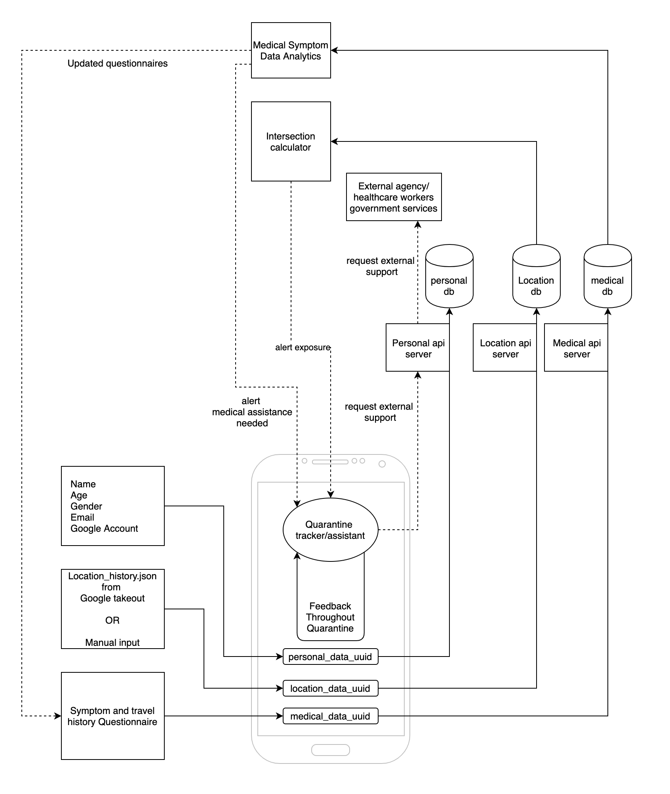

### Architecture of GoCorona App

The overall architecture of the app is as follows:

**Security considerations**

* There are three independent databases with unique keys to identify the user, but the only place where the data can be cross-referenced is in the app, thus the identifying information never leaves the user's device
* Additionally we also do not store IP addresses, IMEI numbers or other details of the user anywhere within the database. Also location data is annonymized
* User is given an option to mark a place as Home address in the app, so the home address or location can also be fuzzed before being sent to the app.
* All heatmaps shown publicly are generated from fuzzy data.
