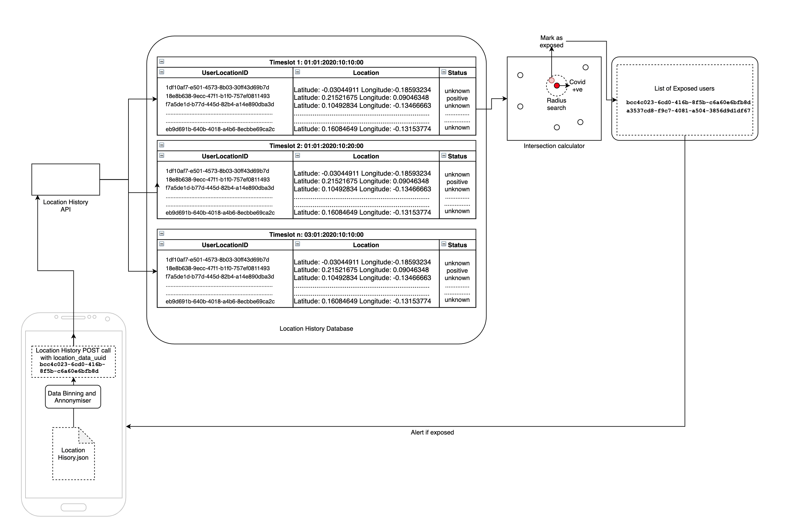

### Architecture of Intersection Calculator 

The overall architecture of the intersection calculator is as follows:

**Intersection calculator workflow**

1. User goes to takeout and gets downloads location_history.json on own device
2. User opens location_history.json on the app
3. The binning and annonymizer puts timestamps into 10 min timeslots and uploads to the API
4. The coordinates go into the binned timeslots on the location history database
5. A batch processing job picks up the timeslot and plots all coordinates onto a map
6. Range search with specified radius of infection (say 10 metres) is performed on all the points
7. If users with status unknown are found in the vicinity of an infected patient, the user is added to exposed users list
8. App queries the List of exposed users with own ID
9. If user id is found in exposed user, backend returns true, else unknown/false